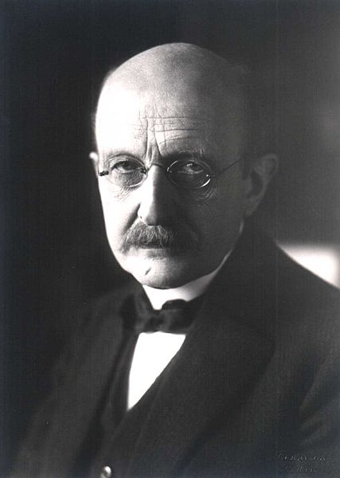

# Save From Pay At Work

(surface) small room electric light young man in English city other
things

(sound) voicing images behind the face feeling other moments falling
through me through the surface of this world look think remember moments
or holidays conscious moment pop up lying in hollow on cliff top just
out of reach or wind pushing up from down out there the sea dark blue
big lingering on that word big noise wind force up over the edge rough
texture and of pushed sucked across dark humourless landscape. Seems no
body in that hole simply position feel position edge of an image the
blue sky alive with technical imperfections curious drifting twisting
transparent spots ! a surprisingly real seagull cuts across cuts
feathers small dry whistle through wind. Pause. Body feel cloth against
legs two legs hand vacantly lingering short dry grass and earth. A
registering of pressure on each ankle one leg laid across the other
coolness over my face feel it this body is my size oh yes simple process
of identity oh yes inside myself here as me with dramatic pause it
finger pointing up at huge blue sky pure empty blue of sunlight
scattered by refracting particles present in this breathe in oh yes eye
and it. The pure blue of the zenith is due to the scattering of light by
oxygen molecules -- oxygen to eyes to oxygen effect yes in out body is
going working dispersing in world inside out surface we change us mouth
sucking mouth stomach sex saliva circular embrace rudimentary endless
feeling levels techniques of distance size unidimensional fall off earth
into water swimming into air falling into fire burning to fine white
nothing like that snow falling on that cold winter afternoon remember
hand turned blue oh yes dull sharp pain my body shiver shudder like
touch naked by sex partner's cold fingers jerking head back look up into
the empty air falling away yawning crevasse opens in blue crystal cold
mouth of the death the final moment is letting go as the floor the
ground falls away legs go limp melting into grainy blue night details
blend out of focus last gasp falls through the surface of that world
quick memory human floor.

Huh! Warm sweat sore teeth and sinus pain uncomfortable neck skull dull
pillow useless bed big orchestral suffering I begin to laugh move arms
and legs sitting among the furniture real and solid on a chair right leg
hooked numb pressure over left and gently rocking, left hand loosely
wedged warm in trouser pocket. Eyes looking wall old sink old stove big
table small bed window -- thinking -- right hand comes up, cigarette
between two fingers to mouth lips round end drawing smoke in down round
out long breath, hand going down licks grey flaking ash sudden into the
gap of air between objects -- breaking against the floor faded pattern
of worn maroon carpet -- silence -- happened -- stomach makes a noise --
urgent heaviness inside -- need to go to the toilet -- into the bathroom
close the door -- unzipping drop trousers and blue nylon underpants --
male legs -- pause -- brown solid twists out -- jerky breathing flesh
functioning muscles release long squirt of yellowish liquid -- next, a
few preparations and munch munch food into face biting friendly toast
and its spread or melting butter all poised in my hand -- five familiar
arrange moveables pale red blue green yellow wax shadows (looking at it)
mechanics and creased skin -- thin dark hairs curling out senseless --
remnant of an ancestral fur, they tell me -- growing evidence of
repeating everyday food and body development to maintain some schedule
of renewal -- hand to mouth taste digest and release -- human body,
physical sensation on me like waking in a bad smell -- same old world --
small room seen in electric light -- blatant yellow glow reinforcing the
surface of things -- hard -- objects real solid matter -- hit -- hurt --
held -- moving -- standing -- look in the mirror -- eyes are soft wet
lens and very small nerve mechanisms -- using them to look at them and
don't understand -- too complicated for me -- no wait hang on it is me
(yes, hand adjusts hair) -- here -- hit -- hurt -- living thing -- dog
lizard -- man -- his hand on the door handle turn the handle turn the
lock pull opened step into corridor pull shut click -- dark passageway
smell of lino and disinfectant hollow sound of footsteps in narrow hall
-- the front door is big old green always open to the weather.

'Suppose that could be taken as a symbol for something' I observe
buttoning my coat turning up the collar -- down three steps through the
creaking old metal gate unto the pavement -- look up at the dark window,
one of many seen on cold morning walk down the same streets solitary
footsteps shoulders hunched with hands stuffed in trouser pockets cold
cloth against my legs -- pale morning flesh standing a t the bus stop
going to the place of employment -- old brick building -- morning to
night look at the clock -- my clothes my hairstyle my friends -- waiting
talking waiting working talking waiting -- quick goodbye -- out onto the
dark wet pavement -- car tyres in the rain -- mushy traffic drone --
sickly orange streetlight -- white neon detail through chip shop window
-- industrial road -- slow breaking sound and hiss of hydraulic doors --
'city centre please' -- bus interior round corners into big bright
street -- shop window -- shop window -- twentieth century electric
glamour -- shop window -- shop window -- dark mirrored street of human
need -- me reflected in the street in the window in the street --
unassailable fact -- understood -- then\... I am sitting alone in soft
music pub interior (patterned red velvet wallpaper) -- people at other
tables -- dark mood handsome me looking into them -- no real answer --
alien -- cold quick walk -- home, this small room -- switch on the light
-- light gas-fire -- over to the stove -- kettle on to boil -- clear a
seat, sit close at the fire soaking heat into my own personal body so it
warms -- making the tea -- good hot mug of tea and lighting up a
cigarette -- balancing in the warmth of the fire listen to music --
water heater heating water for a bath -- waiting\... then, close the
bathroom door -- stepping down naked into thin hot liquid almost like
returning inside oneself -- singing skin -- ah\... relax -- turning on
the hot tap again -- own body -- on my own -- (jingling feeling --
stomach knows\...) -- a casual erection and\... -- I am in my limbs --
sound of water -- pump -- burning up -- fire tube end -- sharp emission
-- done -- (must stop doing that indulging dumb thrill, should be the
'physical expression of the deepest human emotion') -- moment of body as
lump -- dejected -- remembering -- warm evening -- on my back in the
Adriatic -- thin boy -- came in family on holiday visit, Venice 1965 --
warm evening -- empty beach -- sand and sea -- learning alone -- swim on
my back -- floating -- dusk blue shadow across the sky -- calm drama --
I look straight out into space lying on my back in the warm salt water
-- (salt taste -- sea smell -- liquid transfer of sound -- washing --
there -- me -- what?) -- didn't know what to think -- paused breathing
-- body -- the natural world -- fresh -- going -- (Grindelwald 1971) --
Alpine valley -- early morning up and walking -- wet grass -- distant
sounds in the still air -- sunshine over the mountain edge -- forest
pine -- glacier stream -- old old stone -- deep colours -- earth -- seed
-- spirit -- fresh -- to breathe there\... -- small room -- electric
light -- out! -- walk away -- (this activity trailing off never had much
of anything coherent to say -- some dark mouth -- memory.)

(next evening) \...no, no good this must first be cleared -- the call
the mission! (emission) -- laughing at himself -- the excuses -- but
true, the pressure -- to stop now is to drown -- bad mind sinking heavy
with curse -- child sing-song voice 'na na nana na -- wasn't one --
didn't do it -- no one respected you' -- one cannot go back -- not buy a
typewriter in Autumn 1973 -- cannot break the contract (contracting
myself -- book equals pressure -- big truth -- diamond -- knife --
release)

(recurring fragment of conversation) 'Writing a book.' -- 'Oh, same old
story -- what's this one called?' -- 'The Uncertain Affair' -- 'The
Uncertain Affair?' -- 'Yes' -- 'Suppose you now want me to ask what its
about?' -- 'Please.' -- 'what's it about?' -- 'Not too sure' -- 'Ha ha
very funny' -- 'No seriously I don't really know -- it's a detective
story -- hero is the typical cool hard loner -- lives in his office --
sleeps with his hat on, etc. -- finds himself awake one morning and
confused -- uncertain'

(When I came to my senses I had the feeling that something was happening
-- what? -- I look around me -- the room is silent -- work? -- no --
nothing -- 'what's goin' on!' -- my voice startles me -- sounded worried
-- alarmed -- standing capable breathing, but\... -- being pushed --
hesitating -- indecision -- what? -- (looking around) -- silent room or
no silent room something's up -- being pushed -- needed -- work\... find
the client' -- he pushes his hat back on his head, gives a long low
whistle, pulls pencil and paper from the desk and begins to write\...
'circumstances -- in here happening -- work of others surrounds -- me
origin of this uncertain facial expression (sullen)

hesitating -- what? -- wrong -- continuing as wrong -- but thinking --
look -- this world -- yes -- strange complex place -- yes -- yet
ordinary -- familiar things -- yes -- and I live here -- with tendency
for wonder and tendency for routine -- assume therefore I am regulating
with my will -- my humour -- which is? -- this\...' -- slips pencil and
paper into his pocket -- laughs himself out the door down the steps --
walking the big city streets -- thinking\... 'happening -- walking --
world at feet -- think like stumbling -- falling on face -- in it -- on
the scent -- evocations -- memories -- feeling down associations --
similarities -- symbols -- any old metaphor -- thinking -- hand in the
dark -- reiterating')

'So what happens?' -- 'things -- things happen -- attempting to balance
wonder and routine with this assumed will, he embarks on a voyage of
discovery (a euphemism for his survival), understanding like a voice
telling in the head' -- ('things suggest themselves as I write' is how
we authors usually explain it -- 'flood through the dark mouth of the
subconscious, I presume') -- the world as evidence suggesting lines
towards that absent client audience of this person push pulled through
the everyday life until the 'reality' vaguely collected functions itself
as some tragic accident -- any moment now stepping off the pavement
looking the wrong way -- pedestrian sprints like a dancer between the
on-coming traffic -- (face mouthing idiot behind car window) --
pedestrian pretends he's the cool American laughs at death slipping in
late for work and the manager like grim shepherd waits beneath the
office clock his cigarette tight between lips and fingers -- a local
boy, grew up during the war years, now a man -- conventional haircut,
darkish suit, white shirt, pale plump face -- his individuality
exhibited in a thin line moustache -- (he sees me) -- 'come on lad, play
the game -- eight o'clock is eight o'clock -- right -- eh! -- not good'
(silence as he takes me in) 'go find Roy, he'll tell you what needs
doing' -- Roy is the foreman -- simple rounded face beneath which his
emotions confuse -- hurt child or cunning bastard -- thirty five and
living with his mother -- 'what'd Fred say?' -- 'he said ask you' --
'oh' (long pause, he looks at me) 'what kept you then, eh?' -- I say
'ah' a number of times as if searching for an excuse -- 'well I\'ll tell
you what -- down there' (he points down a dark tiled-walled corridor)
'you\'ll find a storeroom -- it needs clearing -- you\'ll get a brush in
there' (he indicates with a jerk of his head to a large cupboard beside
us) 'we had an Irish guy in here about two month ago -- Paddy 0'\...
something, can't remember -- you know him?' -- 'no' -- I open the door
-- take out a brush -- and close the door -- 'well what are you waiting
for!' -- I walked off down the corridor and found the room -- 'like a
gas chamber' I observed -- heaved a few things around stacking them
against the wall -- sweeping the damp concrete floor with those
automatic sweeping movements and the brisking sound of stiff brush and
dull knock against the wall when I try and get it right into the
corners, might as well make a good job of it eh? -- (shaking head
slowly), weak fool -- falling into place -- eyes closing -- vision lost
-- beginning to die -- slow death of servants -- look at yourself -- you
see life -- in the light of mysteries -- cannot be taken serious -- I
mean what is he doing! -- why he's tidying up, silly -- isn't it obvious
-- moves this to here, etc. -- and examine the reason and it's because
he can't be himself alone -- so the coward pretends -- hiding here in
the secured world -- talking through perhaps valuable hours lost like
all us limited beings in the ever so wonderful mishmash of nature --
hell! -- (takes long deep breath) -- if only if only -- if only I could
stop that thinking -- accept my decisions as they are made -- and value
every moment -- let these simple tasks teach my nature the necessary
nature of things and live in this world for what it is -- (I bow my head
like the simple peasant) -- turn me humble like they recommend -- no (I
know why they want to think humble) -- quiet! let's have a cigarette --
yes -- take out the packet -- one left -- good, I'l1 give up (know I
won't) -- ha ha very clever -- strike match light cigarette and flick
match away -- sharpness of smoke passing through dry mouth and nasal
passage -- not very nice -- wish I could stop -- begin to sing\... dupe
dupe do do de dupe dupe de dupe dupe de dupe de dupe de do de dupe am
dupe -- playing push the brush half-heartedly in one hand sudden
someone's watching 'use both hands lad' the manager is standing in the
doorway looking at me with cold moral eyes -- (the old fake) -- stating
a fear and respect position -- control over me -- I understand -- if I
am to remain he should be carefully resisted -- confidently ignored --
he is nothing -- 'you're here to work' -- money -- I can say nothing --
that silence becomes his power -- and the world performs as usual --
obey hidden physical language -- puppets of fear and body -- his
situation -- I am embarrassed -- knowing I am wrong here -- it is their
world -- working men with a strength of ignorance have built over the
earth and owned it -- industrial city -- I appear to be their enemy --
fight! -- no -- no, there's still something to lose -- (this) -- this
arrangement is necessary -- buying time -- things to do, remember --
secrets must be written out -- yes -- patience please -- pretend --
comply -- and he goes -- (stand there and run back the events -- learn
that language of situations and never again be vulnerable, embarrassed
-- the hero will be inscrutable -- but next time never seems to come the
same -- learn!)

'ha ha -- he caught you, eh?' -- 'huh\... yes' -- (Eddie, a fellow
worker -- young married man -- football fan -- a good lad at heart)
'he's not a bad gaffer if you treat him right but see if you rub him the
wrong way you've had it mate -- wham -- socko! -- out on the floor -- no
joke, used to be amateur champion of Yorkshire -- you can stop that now,
tea break come on -- no just leave it there -- come on' -- we walk
through the building -- I feel awkward -- new -- put my foot ankle deep
into an oily puddle -- iIt was funny -- don't care -- exaggerated leg
shaking -- Eddie laughs -- relax -- I am intelligent -- I understand --
not serious, remember -- just out of place -- 'we've got to empty those
bins afterwards, ok?' -- 'wonderful\...' -- open the door -- enter a
small narrow room -- two bracketed planks serve as seats -- at the end
of the room farthest from the door, a simple square table -- above it,
close to the ceiling a textured glass window -- the light is thin -- two
men sit opposite each other at the table -- one on the right, Ronnie
(age thirty, restless and muscular -- eyes close together) handling a
pack of cards -- one on the left, Trev (same age -- married with seven
kids -- when he speaks you notice one of his front teeth is crooked)
biting into a bread roll -- they look, make some kind of greeting -- we
sit (me on the right -- Eddie on the left) a -- few minutes pass in
forgettable conversation -- Ronnie is the centre of opinion -- then an
electric bell rings -- he says 'your turn' to Trev, who shows his
reluctance, swears and stands up -- gets past Eddie with a bit of
friendly leg kicking -- goes out -- 'close the door mate' Ron is asking
-- I get up close it and sit down -- a few minutes -- then someone
outside kicks it and shouts 'open the bloody door!' -- I get up and open
it, the other two laugh -- Trev enters with four mugs of tea 'nearly
dropped the fuckin' things -- move up' -- sits down takes a big slurp
out of his mug puts it down rubs his hands together 'right lads how\'s
about a couple of quick hands we got time' -- Ronnie shuffles the cards
and deals them out -- we watch -- I pick up my hand and sort out (they
take it seriously happy as they bait each other in loud voices -- each
accepting the that the hand he gets is his own and playing it to keep
the game going so he can try and win -- a microcosm) 'hey! our kid --
wakey wakey -- you playing or not?' -- 'huh' -- 'play a fucking card!'
-- 'sorry' -- he turns to the others 'in bleeding dream world, eh' -- he
plays -- 'right, I win -- let's see your hand kid -- ten -- twelve --
fifteen' (raps the table with his knuckles) 'pay' -- this repeats until
the bell rings again -- and Roy is at the door, 'right lads -- come on
fair's fair -- you two empty the bins\...' -- this repeats five days two
days off -- eight to ten thirty -- ten forty five to twelve thirty --
one thirty to three -- three fifteen to five -- time passes in other
peoples work -- my career -- and you're right, I don\'t have to do it --
could be something else -- do this -- get paid for something I think
worth the effort -- get Job satisfaction (like when I think It's ok,
writing good book -- relax) -- but\... -- I know I have no career want
no career -- living is enough without repetitive serious doing -- the
problems of business -- we will not come tomorrow -- yes -- must not be
scared -- yes free

seven in the morning knock the door -- 'right -- my name is Steel -- Mr
Steel to you -- and don't laugh son I see the joke and tell you it is no
joke' (this is a policeman -- his partner is closing the door) -- oh my
god! -- (waking up) -- the law -- court -- end -- this is going too far
-- terrible world -- calm -- calm! -- middle class kid's guilt panic
pumping the heart hard -- nervous -- I am trembling -- happening to me
-- caught in new process -- body arrested -- in it now -- favourite
authors talked of this -- living on the edge -- romantic underworld --
but this i s real -- could have wrong ending -- 'we're just doing our
job son' -- 'nothing personal you understand -- we\'ve got to eat like
everyone else' -- he comes on like a tired uncle asks me to make him
coffee and for a moment looks sad there in his world lost in problems of
ambition, attired with trendy moustache, sheepskin coat and fancy tie,
being friendly with the criminal ('hope you're not putting any drugs in
that coffee') but like he says this is nothing personal just an abstract
exercise in promotion -- 'right we're in a hurry ever stolen anything
don't say no 'cause listen I'm not the nice guy who believes your little
lies we've all stolen one time or another even me I'm no saint -- right?
-- right -- a few books -- a few books he says -- tv licence? -- no tv
licence -- bad -- very bad, and let's not forget these missing Giro
cheques of yours got to have someone for that you see -- you're in
trouble kid make no mistake but I like you you\'re a clever lad I can
see that -- I'm going to give you one more chance tell me what I want to
hear and I'll see what we can do can't promise anything -- except if I
get the impression you're holding out on us we'll have the uniforms in
here so fast believe me you won't know what hit you so you've got to
three I'm a busy man -- think -- one -- two' -- (tell the truth -- truth
saves) 'three\...' -- he won -- stupid excited drunk exploit and its
evidence revealed and documented -- 'good lad, now this is how it is
sometimes we catch a big fish but most times just little ones like you
-- so when we catch a small one we try'n use it to catch a big'un --
understand' -- to emphasise this point he pokes me with his finger --
'nothing personal you understand -- all got to keep fishing' (his
partner is picking up a pile of books saying 'ten years') -- 'you've a
got to help us now or we can't help you (poke) know what I mean, what we
need is that big fish' -- his face is blank and serious -- (looking at
it -- we are all lost -- just routine arrest -- power given to he who
wants it, takes it -- brute force -- crude -- sly animal -- the
professional -- gets results) -- 'you look like the kind of kid who
might know where to buy some drugs eh, know what I'm talking about? --
right, here's our number' -- he writes it out on a page of his note_book
tears it off folds it neatly and hands it to me -- 'set up someone, you
know pretend you want to buy some then make some excuse, have to go to
the toilet, o something, get to a phone and ring that number' -- (the
man's an idiot) -- 'you're in court on Monday so\... -- don't forget --
you're in big trouble now -- if you can help us I'll put in a word for
you with the old man -- if not\... -- tough -- so remember -- Monday --
understand -- nothing personal'

Monday morning -- bus into town -- shirt and tie -- up the big classical
steps of City Hall -- pale lime green corridors -- courage -- 'no, no
luck' -- humour them with reasonable excuses -- seems like I am a
valuable commodity) -- ten minutes -- people -- policeman leads me
in\... -- postponed three weeks -- he takes me down to the canteen --
carefully chooses an isolated table -- repeats what he said before --
(war won't work without fear -- be nice -- sympathise -- agree -- he
goes)

three weeks later -- I stood in a small strategically oppressive room
and a magistrate resting his head in his hand said 'I do not understand
-- thirty five pounds' -- save from pay at work -- (excitement over)

its another day wasting and I wander aimlessly like a tourist of the
mind past old pictures. Memory, you understand. a small body in a
limited landscape -- primitive drama -- details naively simplified --
its innocence has a certain charm but obviously the work of a child --
next\... carefully preserved fragments of a fading mural -- blue and
white tiled bathroom -- summer light -- two boys -- one with smooth
darker skin standing by the basin in only a white T-shirt, wanking --
the other sits on the edge of the bath his shorts pushed down, learning
-- (this place lacked only one thing, young girls to be with -- they
soon became the object of worship and fear -- inaccessible -- what do
they do besides look like that? -- I pretended -- we pretended) -- naked
boy figures behind bushes, in bathrooms and bedrooms (there is no
attempt at a realistic effect, the scenes are represented against a
plain background, the interest entirely -- concentrated on the movement
and expression of the figures) hiding -- one being the master and one
the slave (feeling the stomach mix of submission and male emission)
sucking off or sitting on the other making him manipulate -- spurt spurt
-- DISGUSTING! -- giving me an er\... let's get outa here, please!
they'll think me the pervert lingering over this kinda filth -- ignorant
pagan ritual a long time ago -- base culture -- bad thinking -- thick
servants of the urge -- desperate pleasure -- forget it! -- laugh at the
stupid little ancestors -- we've come a long way since then -- learnt to
control those passions in a dignified way -- dear me, this is
embarrassing -- walk quickly out -- next\... tall skinny grammar school
pupil reading paperback anarchism in the top corridor of the English
block during lunch break -- old scrubbed floor -- dark panelled walls --
sepia varnish -- old picture -- nineteenth century -- dry academic
school of old masters -- frustrated repetition -- stale culture --
suddenly (for socio-economic reasons\... 'the light of the south' --
warm colour -- hitch-hiking youth walking through cool foreign gallery
considering his career, Gauguin Van Gogh etc\...

the tourist stops -- looks into distant rooms and gives a weakening
smile, flicking through the information, endless list of detailed
exhibits -- a dead weight -- old hopes and failures preserved for this
sterile twentieth century dead end -- a confusion of nostalgic
references jerk past in huge photographic collage reflecting the times
we live in -- the magic of culture begins to fade -- looking for the
exit, escape, step out into white sunlight exactly like that shafting
down into this dark brick building -- it was summer this morning -- yes,
a beautiful morning -- another summer is gone unless\... go now, walk
and forget alone

'wake up lad! play the game, hands out of pockets!' -- yes yes
surprised, his voice immediately behind me, I go through the motions
but\... no real enthusiasm for this business -- factory world -- 'one
big family -- lend a hand, lad -- pull your weight and we'll see you
well enough looked after -- but you who do you think you are, bloody
Jesus Christ or what -- time is money -- how many times must you be told
-- you don't like it you know what you can do -- or knuckle under, work
your way up -- that's the way it is -- wasn't easy still isn't' (pause)
'we're running at a loss -- you may have noticed -- times are bad, yet
they got to keep us open -- public service -- understand?' -- 'yes, I
understand' -- 'good -- well, come on come on what are you waiting for
-- he walks slowly over to a small drain cover -- looks down at it then
looks over at me -- 'you clear this last week? -- thought not -- well do
it' -- telephone is ringing -- he goes

\...and then it was half twelve to half one, lunch -- it is summer --
sun is shining -- up on the roof -- a ninety three million mile touch
warms the air like liquid over closes eyelids -- coloured flesh -- a
personal entertainment we could call it -- distance becomes a matter of
preference -- ideas think themselves -- 'writing' -- an idea -- say it
like this- like in Sahara of shifting yellow light this body fades
outlines -- feeling my back on the floor the roof the floor that will in
time fall away -- any moment now -- but not this moment -- and -- not
this -- and -- suck it in -- and -- push it out -- again -- again --
falling -- a speck of something falls against my eyelid and it jerks
tighter shut -- someone cares -- 'thanks Charlie -- carry on', entertain
myself by thanking the other -- tick of the body the limbs and
functions- seeing myself as person of the mind inside the head the voice
and feelings -- the differences are personified -- characters emerge

(the thinker amusing himself reading meaning in the obscure) -- Charlie
given this name originally from a picture in a kids' comic\... in a
studio a grinning compere and a chuckling ola man who never really grew
up -- 'do you remember the prank you played on your childhood friend
Charlie Grunt?' -- 'oh yes\... replies the innocent old man trying to
remember -- 'that was a long time ago -- left him holding the baby,
didn't I? -- yes, appeared able to manage -- like he was born to it
(chuckle chuckle) 'so\... well, you know how it is, if it works keep
your nose out -- like to think I'm above that kinda stuff really that
worry and boring work -- ugh! -- no, I'm what you could call a natural
passenger the reflective eye, observer of life's rich and varied
pattern, etc. -- yes, and needed right here where I am -- without this
interest and concern he'd he'd 've been 'dead' years ago, poor thing --
I act sort of, how they say\... in loco parentis -- smile and hold his
hand -- encourage protect scold and correct just like any other adult --
it's on me he relies -- I must decide, point the way but you know to be
honest the best is just an educated guess) 'an\... that way' making
imperious gesture with the hand and off we go and\...

'to pass the time I'd entertain notions -- most persistent was Mr B --
an ageing homosexual drunk -- 'boys\...' he would say 'can you believe
it -- I\... I was once an actual noble savage -- beautiful naked
creature -- ha, those were the days' his old beat face shines with an
inner light -- his eyes fill with tears -- every word he ever spoke was
an exaggerated lie -- sad old man recollecting himself through eager
young eyes -- but, lies or no he was the best company we had -- 'seem to
remember boys once we'd just reach out like that' (sweeps his hand out
in a grand theatrical gesture) 'and pick whatever our hearts did desire
-- and yet we never had much cause to want in those days -- makes me sad
to think on it' -- something useless in that sadness which even he
seemed to recognise -- yet never knew him do much else but lament -- for
example 'this moment locked in a constant hustle to maintain ourselves
-- ugh! -- I can remember -- (it must be a memory) -- remember moving in
light that was space that was solid but wasn't -- can't explain -- none
of these noises apply' -- 'no, go on it sounds intriguing -- 1 think I
understand' -- mixes sigh and smile and continues 'no cruel opposites
because all is of one flesh and not alone because there is no thought of
other -- (he rests his fingers lightly on my knee) 'a matter of being
the part and the whole simultaneously -- being inside oneself as any one
piece aware of the limitless stretch of self yet to move into as
naturally as walking with forgiven steps across fields of growing grass,
insects, etc. all other life' (pause) 'understand?' -- 'oh yes'- 'no you
don't, you think I'm referring somewhat elaborately to those lands you
dream -- strolling musician eating bread and wine sleeping having
empathy and other pleasures with little natives -- that\'s all very fine
but I refer to something beyond\...' (his voice lingering on that word)
'pre-natal maybe' (he laughs) 'flying swimming air water light
shimmering agreeable process of motion without specific body -- pretty
hard for you guys to imagine, eh' -- he begins to vibrate -- in and out
of focus, in and out of detail -- going into some kind of trance -- air
filling with romantic ending cacophony -- celestial choirs gibbering
extravagant poetry until after a few spasms he falls to the floor -- yes
it was like he said, hard to imagine (except of course as same an
'eternal moment' -- endless orgasm) -- liked what he said -- filled a
need -- sounded good -- but yet it remained too vague to grasp -- the
words were empty like death -- nothing to go on -- a mystery -- a
fascinating entertainment -- yes, guess he was just an old fox who knew
what some folks like to hear -- Charlie would often say that -- they
were never the greatest of friends -- 'too profane, my dear' Mr B would
declare, 'this place no good -- let us slip oh you tea' (a euphemism for
dragging razor edge through meat and sinew of each wrist -- the red
blood pumps into the outside dripping wet into the carpet -- the wounds
open unmendable -- becoming weak, fading -- that was life -- ended) 'no!
not with these hands you don't and thats that, when our body says no the
discussion is closed -- can't help but feel sorry for him, poor kid --
it was always the same -- sometimes after B and I had has a few we'd get
to dancing -- leading him on -- I'm sure he never understood what we
were driving at but dutifully he'd put foot to floor and there we'd be
hanging out all excited and laughing like a pair of kids off to the
seaside, wind on the face, blowing through the hair, etc. -- Charlie
happy but strained -- edgy -- his eyes rolling like he don't know where
to focus -- suddenly, limbs go limp -- loses his grip, 'getting outa
hand! not made for this kinda use' -- his words are certain -- take
control -- we return gradually to normal and.. feeling I'm making
mistakes -- looking back with regret at intentions marred by flaws and
omissions as if by some product of malice (they call it IMPERFECT) --
hesitations of crude fragile vanity -- and I am impatient -- 'I want to
see him right away' -- 'I'm sorry sir but he's not in at present -- I
knew it -- stuck -- trapped by my own means -- hell -- the mouth opens
under my feet falling away goodbye Charlie all channels shutting down
zero in all voices mumble across each other bones turn brittle flesh
drying turned to dust on the factory floor the worker sweeps us into yet
another pile -- 'I want to see him right away' -- 'I'm sorry but he's
not in at present -- just the way it is' -- they keep telling me that --
life sentence -- human on planet -- curse many million years surging
volcanic rock floating molluscs thin green plants making oxygen a long
time ago I turn to go -- 'what's on your mind?' (asking silent with her
eyes) 'perhaps I can help' -- I push out lost boy's sad smile, internal
dialogue running something like\... (she wants to help -- she doesn't
understand -- understand what -- find the answer in the whole of her --
crude joke -- she will not understand the thinking -- one morning you
will not want her in the room -- cold morning light on those little
uglinesses you have noticed but think you can forgive or forget --
remember also a constant fear of commitment -- nothing can happen here
-- I must go -- what can I do I want to be kind -- I am too old and too
young) -- I catch myself embarrassed looking from her body -- could she
be the one? not a serious question -- the crowds are full of others --
streets and rooms full) -- be the other part -- loved one -- (looking at
her face) girl face -- the feminine -- mouth soft, eyes asking -- beauty
-- deep simple beauty in a face (in the street faces passing effect me
and I am puzzled -- even faded beauty is strong) -- my heart reaches out
-- I can feel it actually pushing out in my struggle towards
conversation (is it really this difficult) -- we both smile politely at
some normal comment I find I've made about life -- hopeless -- what I
want to say is I love what your face conveys -- it starts things deep in
me even through it may simply be a breeding mechanism -- 1'd like to
touch you -- afternoons of sex -- hindered -- I am being hindered --
circumstances conspire -- vast distance they call this the isolation or
the individual, I believe) -- can't -- not here not like this -- absurd
-- my fault (among others) -- I am impatient -- caught up -- vague
forces remove us to an alcohol gathering -- smoking cigarette and
drinking dark rum sprawled back out on the seat -- foot beating out the
rhythm -- throwing 'humorous' comments into the group of them --
familiar indefinite effect of alcohol -- (picking up the glass again) --
an excited nervous not stopping to think lighting up another cigarette
from the offered packet -- playing tricks like taking two or palming the
one I've got and saying thank you very much then lighting the one I take
with it and\... -- all with background drinking talk noises and laughing
despair numbness of being here on the edge with anaesthetic in the face
looking for the party, 'where's the party?' -- 'what party?' she laughs
(we're rather awkwardly slouched side by side) 'the party any party!' --
she affectionately leans close on me 'sometimes you're just like a
little boy' -- its done -- I have become a special one -- one she will
come to -- did I really ask? -- want sex -- her face and neck soft
porous flesh perfect material -- start talking nicely -- awkward
tenderness -- (no harsh realities, why spoil the fun?) -- young couple
-- walking holding close round each other -- hand beneath coat -- street
at night -- firm other flesh -- her -- fingers placed on alive edge of
waist -- little tortured sigh -- hold -- stomach tight anticipation --
sex! -- keep talking -- the soft laughing voice -- sympathise with her
-- (yes she is drunk) -- kissing -- taxi -- front door -- bed --
slipping in beside each other naked against sheets and flesh clasp
roundness firm in arm press round smooth shoulder neck face between
holding hands gentle down on kissing taste hardness of teeth tongue
mouth wet lips soft detail eyelids close with open hand tracing down
movement stomach and leg skin rub us bent to damp crotch cunt ribbon
filament at finger tip image jerking strain body pressing hard to bury
stiff cock jerking at hands urgent groan placing at her on her in her
push grown in deep planted in body urge root rutt numb dumb pain of
pleasure she placing her hands at the base of my back clench arse push
more she lies passive me on her no think touch me in urge (light from
the window) kiss lick shove hilt shaft doing it ah inside inside mmmnh
in mmmnh beating uhuhuh -- pump -- pump -- pump pump -- echo -- thats it
-- in embrace to sleep -- warm smell bodies -- heard I love you said --
sad -- love? -- turn over -- morning -- we are polite -- she is not the
one -- mistaken -- same old world on her lips -- is she waiting for me
to say something? -- better to sleep alone -- returned to the office --
clothed -- silence -- (reach out both hands and hold her?- no, sad
enough)

'would you like a cup of tea?' she asks -- 'please' I reply -- the
atmosphere feels very ordinary, it's almost as if we have become
different people -- standing filling the kettle turns easily to me and
asks 'what about your friend, the one you shared the flat with, is he
gone for good' -- 'yes' -- 'that's a shame, he was good for a laugh' --
'Yes' -- 'living by yourself now?' -- 'yes' -- 'you miss him?' --
'sometimes' -- 'don't say much do you?' -- 'sometimes' -- 'you were
close weren't you -- we thought you were brothers' -- 'I know' -- 'what
happened, have a lovers' tiff or something!' -- 'no, just stoped --
there was another, a third -- you met him once and disliked him --
remember?' -- 'not really' -- '\...for a while it was special together
-- three friends -- a language group -- close -- maintaining each other
-- trying to talk the truth -- but truth can't talk, cuts back on itself
-- we were to go wild boys drifting south -- kief and dancers, etc. --
didn't happen -- stuck talking it over and over -- end -- in the end
there's nothing to say when nothing is done -- nothing important --
contact falls loose -- useless arguments -- trust gone -- hollow -- old
routines hold together for a time pretending an end impossible --
planning the future -- but things continue to happen and then now, the
episode is over -- incidents to recall, try and understand what didn't
even happen -- what a joke -- poor thing -- thinking that did happen --
it shadows me now, like something has died, a part of me\... -- perhaps
I should record for future generations all those legendary things we did
-- the times we had -- sharp fast intoxicated conversations -- the
violent humour that half-scared, half-thrilled me -- the truly weird all
night sessions with our gadgets and drugs\... -- no -- funny thing is I
can't really remember -- just bits, various moments, they just open up
inside me -- a sharp image -- poignant details -- \...and I see that at
the time it was important -- 'I was telling myself it was important --
young heroes in the making -- old heroes -- waiting for the world to
walk in and applaud -- the new voice -- the new vision -- but\... in the
light of it ending it now seems rather foolish and juvenile -- (that's
what I tell myself -- we have to survive) -- we were younger than we
thought -- assumed friendship could mean the new life would not have to
be attempted alone -- alone in this incomplete person -- the coward --
used those others for support -- hoped they could ease the inadequacies
-- need other voices to talk with -- needed the confidence of a group --
a friendly audience -- wanted others to be with me and share the burden
of decision that is life -- I don't want to talk about it, we are alone
-- friends leave -- there is no way to hold\...' -- 'tea's ready --
sorry, what were you saying?' -- 'not important, forget it -- thanks' --
I take the cup of tea and a biscuit from the tin -- silence -- 'you
think you're the only one who suffers don't you?' -- 'ha I feel only my
own pain -- yes I can be polite and sympathise, I can even try and help,
imagine it happening to me, imagine how I would feel, but that's only
civilised -- I feel only what hurts me -- I suffer inside this body -- I
suffer alone -- the sympathy and understanding is just language -- you
read it in faces, in expressions, in images of wounds and frightening
thoughts -- in words -- and if the sufferer is not an enemy you
sympathise, but from outside the pain -- you can ignore it -- harden,
become indifferent -- you do that all the time but perhaps you can't
admit it, would endanger your position as a good considerate christian
-- the feeling of others pain is a convenient way to define our place
and person -- you try to be concerned with the suffering of others -- it
is important -- you are watching for signs of pain or sorrow in those
nearest and dearest- your attitude holds your sympathy open for news of
sad disasters -- yet there are those out of favour -- those you can't
love -- those who threaten perhaps only subtly -- but your reticence
betrays you -- you can't really love your enemies -- tolerate, yes -- a
polite coldness, but not love -- you couldn't embrace them, not actually
-- you might have thought you could when they were at a distance, but
not when they're close -- imagine\... threatening up close, nauseating
-- ugh!' -- 'please!' -- 'sorry, did you feel threatened? -- you see, we
are alone' -- silence -- she coughs politely, probably thinking how to
get rid of me -- 'you wanted to know something?' (cold dignified manner)
-- 'yes -- I forget -- no I don't, imperfect -- me and you, imperfect --
no good -- idiots seeking satisfaction -- a mistake -- a shame -- so
what is this life but failure or a convenient lie -- pretend it's
tolerable -- passable -- that there is a continuity -- a healthy
normality -- you are a secretary -- and this is an office -- and I came
in here discontented demanding to see the manager, the boss -- god
himself, who cares, what's in a name -- but that meeting wasn't
available -- so I tried you -- but that was wrong, I should've known
better than to talk a young girl into bed with no reason other than to
get into some animal lust -- but\... -- a common human failing -- yes
let's say we're all at the mercy of sex -- its only natural really, for
the survival of the species -- so let's say it has its ah\...
compensations -- yes -- let's agree that life may hot be perfect but it
is at least tolerable -- let's pretend' (she is looking at my eyes)
'let's pretend that it is normal, this is normal -- \...that individual
life is small -that all it has is its little pleasures -- we are just
little people needing love in a normal imperfect world -- but\... (we
sigh), that's life -- isn't that right? I mean our lives are just our
lives, they couldn't be a metaphor or anything could they eh?, --
repeated representation of the same old mistakes -- repeating children
children -- illusions of history and progress -- same old weaknesses --
fear of the unknown -- fear of the final truth!' -- 'excuse me, I don't
know what you are talking about -- I mean I do know, death, isn't that
right? what I don't understand is why you must shout about it and accuse
us of committing some crime because we don't talk about it twenty-four
hours a day -- we're not all like you you know, some of us are really
very happy -- and we're not as scared of death as you might think, got
one or two ideas of our own you know -- you're right nothing is perfect,
but that's life -- everything is really for the best -- and anyway how
could anything be perfect? tell me that' she finishes, indignant and
slightly nervous -- she probably hates me, an unclean and spiteful
rapist -- my thoughts are unclear, I've forgotten what I was trying to
prove anyway -- there's something missing in her attitude I know that
but explanation is a hopeless business -- imperfect -- I admit defeat
with a sad human smile -- 'you're a strange boy' (in a serious but
motherly tone) 'but quick back to work' -- under the circumstances I
could see she was right so I left (ha ha, word play -- terminal
entertainment of a lone intellect -- paradox truth joke etc. -- hell)

evening -- had to get out of this room -- physical silent things with me
human busy worried what to do stood there in the middle looking out at
the night coming down wet and grey -- put the coat on, walk out the door
-- and life goes on -- walking in the rain is a marvellous miserable
cliche -- slowly across the empty park -- wet grass -- wet shoes -- cold
-- stood alone in cold wet clothes -- dark now -- empty -- universe they
call it -- and suffering -- yes -- and we are -- walking -- to the --
pub -- because -- because that is where these people go forget the empty
suffering -- so we will go too -- in the door

Faces -- (see anyone we know? -- no) -- stand at the bar -- money out of
pocket -- get served -- pay -- glass in hand -- (looked at the girl
behind the bar -- her make up and sweet charm -- thought about sex) --
turned and look at the room -- various people -- place to sit -- there
by the radiator -- sit still, empty and calm -- hand reach out -- pick
up glass -- sharp alcohol and place it back down on the small round
table top (haven't eaten much today -- feeling the effect quick seeping
change) -- relax warm -- but these lights are too bright -- vivid people
and objects- (recently I have become too easily aware of the various
strangeness of our vision -- spotting after-image and a grainy vagueness
in shadows, etc. -- if the surfaces of the world were seen as a thick
soup like syrup it would be easier to believe we are in one various
flesh -- wouldn't it? -- yes) -- I take out pencil and paper and write
that down -- then, realising I've begun to feel quite at home in this
room gently seething illusion of oxygen and eye, I walk to the bar and
get myself another drink -- seeing myself in the mirror behind the glass
shelves with display bottles, advertisements, etc. -- the lone young
poet deranging his senses leaning on a typical public bar -- pages full
of strange complaints, objections, old laments -- gives one a great
sense of tradition and\...

some hours later -- in a different bar -- crowded -- (chance rather
unconvincingly providing someone I recognise who seems to know these
students who are in some way connected with a party afterwards, I think)
-- a face towards me saying 'delta P times delta Q is always more than H
and thats a fact' (I am vaguely familiar with what he is saying having
read it in a book myself) 'no -- no good!' I immediately reply -- (I've
noticed this before, a few drinks and I\'ll preach at anyone as if they
understood) 'you see one fact it lies on a next which relies on a next
which\... etc. off into a reasonable distance of investigation -- this
science builds one on another blocking in the world around us -- but\...
based on assumptions -- deep rooted behind and within our every moment
-- understand and you can catch them here vague limits of this life so
far -- understand? -- nothing has been decided -- all is faith' --
'maybe you're right' he sips his beer 'I don't know\... but what I can
say is that when we say position we mean distance from a certain point
on a line and when we say momentum we mean momentum P in the direction
of that line -- understand both cannot be measured at the same instant
and the more accurately one is measured the more any previous knowledge
of the other will be obsolete -- careful investigation has shown that
the two uncertainties delta P and delta Q (the Greek letter delta being
used to indicate the uncertainty of each quantity) are related so that
their product is never less than Planck's constant\...' -- forget what
happened after that -- incoherent muttering -- perhaps singing as I walk
home

but remember the name next morning (sick, etc.) lying in bed -- find the
right book -- Max Planck appears -- frozen in photograph -- from another
time in black and white and grey a shadow of his former self -- 'a real
person' I reflect -- 'like this' (touch myself) 'voice in the head --
talked 1858 to 1947' -- true -- walked into a room and posed in profile
-- educated man 'do you remember that shutter closing, Mr Planck?' --
no, no personal questions -- no use to put words in his mouth -- truth
please\...

'a simple oscillating system -- a pendulum -- weight on a string -- pull
the weight to one side -- it is raised slightly and its potential energy
is increased -- let go -- it begins to move converting potential energy
into kinetic energy which reaches maximum when the weight passes the
lowest point during the remainder of the swing its kinetic energy is
converted back into potential energy until it is all gone -- there is an
instant of rest -- then the weight starts on its downward journey -- if
there was no friction it would swing for all eternity'

'\...For all eternity' dreamy eighteenth century aristocrat repeats the
words over and over -- 'forever -- if only -- imagine -- at last! --
perhaps, exact more energy from falling weights on one side of the wheel
than required to raise those weights on the other -- no -- alas there is
a rule -- energy is neither created nor destroyed, only conserved -- we
have only what we hold -- it is for our own good I suppose -- the will
of God -- but\... it is a hard world and -- ugh! these peasants are
revolting' riot of voices rises in the thin air past his gothic bed
chamber window -- he turns back the sheets -- walks across the room and
looks out -- traders farmers beggars old men simpletons wenches fat
women children cripples fill the village square -- jostling rows -- 'my
kingdom' he sighs ironically -- 'my subjects crude children -- what do
they know of finer feelings -- will they not go -- why must they burden
me -- they bring nothing but their difficulties -- look at them -- poor
limited beings -- if they could only see themselves -- read their own
faces -- on and on they babble -- twisting out their stupid noises --
standing in the snow -- it is always winter here -- but there is nothing
I can do -- what do they expect -- a miracle, some magic spell -- I am a
man of reason not a magician -- my experiments will always be failures
-- I have no hidden powers -- I cannot help you!' (he shouts out -- they
see him acknowledge them -- the noise grows louder) 'oh will they not go
-- they makest my head throb -- I am not well -- I must have peace -- I
am an educated man -- a sensitive man -- I ask little of them except
service and allegiance -- for that I let them work the land -- without
me they are nothing -- nothing! do you hear -- no, they do not' (he
pauses -- realising) 'the moment has come' (he composes himself --
speaks slowly pausing after each word) 'I am enlightened -- I see the
mechanisms of light -- you turn foreign in my eyes -- stupid rows of
worry -- each face I see I read -- each expression speaks wants -- you
think to win me with your threats, your honesty, etc. but\... we see you
simply as surface dark and light -- tones -- you mean nothing -- nothing
I care to understand -- I refuse to read and react -- the world is empty
my head is empty the empty empty ah ha ha ha is the is ah ha empty is ha
ha a a a ugh' -- the character fades from the narrative

no he does not -- a new name is a useless novelty -- soon wears off --
revealing the old position same as ever -- each time I look, for
example, at this page, thinking 'ha ha worked it out this time, just
light surface with dark marks reading from memory' I'm only reworking
the old idea -- the one which suggests that if complete truth can be
grasped, realise exactly what's going on on both sides of this face with
its tongue and flesh grey deceit self-deceit and double self-deceit and
guilt and vanity and all the other bullies of the body, then\... goodbye
last time for happy fade away into the cool thin air -- canceled out --
problems dissolved -- yes, this attempt to understand is an attempt to
end -- see through surface -- see everything being in our one self same
difficult line -- old \@nexorable process -- a l l kinds or sizes packed
underdog under underdog -- one against other -- each within their
limited sense consistency forming certain surface nature to live within
-- think along these lines and vaguely it becomes crystal clear -- the
body melts without purpose -- enlightened -- terminology burnt out --
there will seem an instant truly physical change in to new space, same
place -- like slipping through secret incision to the heart of the
matter -- drawing conclusions -- getting the picture, etc. -- stepping
out into final fade away -- romantic sad but happy ending where the hero
dies the noble way, a faint smile flickering across his lips as he hears
the weakening voices of power gasping last wo\...

in the early hours of the morning. (chemical view states suspicions --
small pale blue pill -- strange bitter 'taste' -- lysergic acid -- a
substance) -- body shaking -- fading from the groin up -- pressure on
the face like the air's getting heavier -- cold cloth against my legs --
small of my own body like a bad reminder -- fear -- vision slanting --
blurring position -- shifting -- I am sitting in a chair -- I do not
know why -- perhaps none is real\... all in the mind -- ha ha -- I am
all wrong -- yes, continuing as wrong -- always -- now not like this --
only description -- what do I control -- struggling control -- try and
remember -- still normal -- no -- perhaps damaged sick in the head -- no
-- perhaps\... no! -- fact -- uncertain person between pleasure and pain
-- who does it hurt -- hurts me -- I can feel it -- sitting here on the
chair, one way to say it through knowledge of extremely small particles
etc. look down into an endless depth of detail) -- everything stated
will be wrong -- exclusive -- more than we can tell -- have always been
surprised at my own being -- so much more happening in me than I
understand (what am I saying!) -- I am not here yes I am -- sudden
shudder, surge ripples up spine flipping me forward like snapping shut
jack knifing muscle -- memory of the noise like gristle cracking in neck
-- OH MY GOD! -- thick tight fear -- anguish -- and down there in the
hand a tattered scrap of paper -- he's trying to leave a diagram --
(last gesture, they must know I died because I found out) -- rough
circle drawn in shaking was pencil in the waving light of gas fire --
divided in four and labeled\... comfort -- happy -- worry -- need --
symbolic of the constant conversation round the awkward outline of the
human body -- I demonstrate\... in front of the fire -- it is hot -- too
hot -- hurting my legs (surface closest to the fire) -- discomfort --
making me concerned -- in pain -- worried, something must be done --
need relief -- change -- sit back from the fire -- sigh -- happier,
enjoying the better feeling -- but\... (a slight shudder) I am getting
cold -- chill feeling in my shoulders and the back of my neck (surface
furtherest from the fire) -- a bit too cold now -- move in closer --
better -- happier with the new warmth -- but\... -- need I say more? no
doubt you see the difficulty inherent in the situation -- I did -- it
hit me -- perfect life truly impossible in this -- each place is surface
of things -- each thing is surface of thought -- each thought is surface
of need -- moving need -- the only possible basic of life in this space
-- need -- word hit me shot through from every conceivable angle and
detail -- eyes look at this gloomy little room -- small modern shelter
-- furniture shaped in quaint dated design -- twentieth century --
wallpaper patterned duck egg blue, cream, and gold arabesques someone
else's idea of nice, not mine -- pale white ceiling dark now in the low
light -- flickering shadow from noisy orange flame combustion of
substances in manufactured amenity -- named 'gas fire' to isolate it as
an individual familiar object -- installed in this room to heat us --
imperfect attempt -- cigarette packs empty in the hearth -- stubbed
butts and the grey ash -- yesterday's used milk cartons -- indefinite
bitter smell -- would you like something? there's more lying about here
somewhere, in the kitchen -- milk -- bread -- butter -- tin of tomato
soup -- potatoes? -- a cigarette then, or anything\... put it into you
-- need and want and get and take and use -- no -- stupid, isn't it just
one simple idea -- the old carpet covering the floor, grit from
pavements in it off my shoes -- shoes over feet and the feet are\... --
no! (turn head) squat cupboard, door half open -- paper, books, personal
things collected over time waiting there -- a closed drawer holding its
contents -- stand up -- walk over -- open it pull it out (the physical
mechanics of weight, wood, friction, design, handle, hand pulling\...)
-- things in a drawer -- look -- walk to the window -- (two legs) --
hanging curtains -- black cloth -- feel the cloth (woven thread
material, fine noise\...) -- wet glass black purple -- the night -- feel
the cold in this air -- remember the world outside? -- look out -- dark
shrub nodding in the wind (old cliche winds of time -- leaves talking --
blank brick wall of the next house -- big world -- hear the traffic
distant driving noise -- machines along that road out front -- details
of their engines -- each journey -- main arterial road -- me in this! --
ugh -- table -- typewriter -- sick little words -- mess of pages --
aspirations -- sickening sensation like falling away -- head swimming --
spinning unbalanced in the body without real centre -- horizontal
falling -- an end is nothing -- this is hell -- we are those eternal
damned -- our original sin to eat -- to live -- there is no life -- no
hope -- useless -- head it jerked back -- floor falling -- look up into
the grainy half light dissolving the ceiling into shouting in the head
-- you are simple subject to an inexorable process -- (at this point I
lose absolutely all trace of dignity and detachment -- squirming victim
of old melodrama -- just another human posture) -- voice of god! -- as
far as I could see I was desperately grovelling at the feet of distant
galaxies -- something at me -- huge complex alien manipulating from the
inside -- thoughts bunch up lock in circles jump fast and faster like
torture -- punished with the truth -- wrath of god -- whimpering
apologies I retreat wounded into my little bed -- fully clothed and
feeling like some bad joke, waxy pulling the rough sheet and blanket
round my face -- every voice I know mumbling the return -- they call my
name -- pulling tight down through me -- feel their expressions as my
face -- I would like to cry -- the noise -- no -- no hope -no hope at
all -- unless\... no! -- wrong and repeating -- this here

reiterating -- different angles -- perhaps -- perhaps -- perhaps dear
reader, you are me and I am this book, eh? -- voice shadow play shadow
of shadow on shadow over an imperfect surface blotched by flaws and
omissions -- unclear -- cramped within the limits of this my style --
writing to you dear reader who read as I write, pointing to mistakes and
failures with perfect and merciless mockery -- listen to me now you
restraint leave off go now out of this -- me -- let me release -- you
burden me with your standing there at the edge reminding, correcting,
and I like a fool pander to your sense of importance, trying to stick to
the stick of your standard -- this idea of literature that is good --
go! I have a rage inside of me -- listen to me as I am -- straight me --
you are not here, not there at the end of this -- I am the source -- let
me out -- correct for who? correct for what -- fear -- social cover -- I
want to be me -

Life's by no means perfect they tell em just got to learn to live with
it -- I demonstrate -- in the city street -- business lines the pavement
-- shop window shop window -- 'chocolate? ice cream?' a voice within
innocently enquires -- here in the pocket against the right hand is
money -- material permission -- (adult voice) 'no!' -- and imagine
'Charlie' pushes in looking up at me like a little girl but the voice is
old -- 'remember spending pocket money in bright red and yellow shop
interior -- I remember -- high counter, sweets out of reach -- a silent
moment of selection -- then transaction -- giving coins to lady\'s soft
wrinkled hand -- taking neat coloured package, opening it just outside
the door, torn wrapper scrapes across the pavement -- hand comes up slow
-- smooth taste to the mouth -- I remember -- a bar of chocolate -- a
treat -- sweet temptation -- naughty boys -- indulge -- guzzle -- break
restrictions -- the pleasure of sin -- mmmn! -- bite chocolate -- we
like it -- remember -- don't be mean -- where's the harm -- it's only
chocolate -- you're exaggerating the issue -- we like it -- what\'s
wrong' (whining) 'pleeease!' -- never really grew up just grew old --
'secretly' I wait half-amused -- and the other voice returns -- thin,
almost insignificant -- tries to influence with cool cutting words --
'heh hem -- what do you think you are doing? -- who do you think you are
-- control yourself -- inner calm -- this 'chocolate' is not necessary
-- not required' (tone of tired insistence) 'why try to maintain that
childhood reality -- a bondage -- habit -- you are being used --
exploited -- manipulated -- understand?' 'yes but\...'

pressure -- a decision must be made -- no choice when you got to choose
-- one power must be appeased -- pushing forces surround create this
person to decide -- urged out of dead to fill a need satisfy a decision
-- an action react for the duration of maintenance -- intentions surge
through bodies -- each decision must be made -- one power must be
appeased -- access laid open to urging power pushing into place for next
eventual decision again what words will he allow to continue extending
this line fingering inside dark mouth where voice comes made by me
talking as certain person tone of opinion -- but word comes of action --
the noun verbs -- without things in situation the conversation soon
fades -- so we keep describing a particular situation for the voice to
comment in and on this line fingering inside dark mouth where voice
comes in many tones, this one blunt language trying to be honest about
trying to be honest about trying to impress with honesty so as to become
significant -- I poet bare my soul to\... -- to enlighten all these poor
limited beings to the true nature of this mess of emotion and violence
yawn yawn -- you know you and your miserable truth embarrassing truths
just make me sick and tired (catch how the tone has changed -- attacking
from different angle) -- unnatural, that's what you are -- inhuman -- we
live to give and get pleasure -- there is nothing more we need to know
-- life is for living -- for fun -- enjoyment -- love?

some human entertainment please! -- because life will go on as long as
it can -- walk down this street this moment this city, past municipal
art gallery -- standing at the entrance steps watching activity in the
light summer evening -- turn and look inside the building -- open for
another hour yet -- could go in and sit and\... -- no -- never did know
what to do with art -- light a cigarette -- walk slowly on -- shop
window -- shop window -- eat? -- no -- can't afford restaurant and
anyway its too sad to sit there alone -- standing in the street --
traffic -- city of human service -- crowding strangers' faces in too
close -- no thank you -- no thank you! -- oh to be somewhere else --
forget in a cinema -- dream exotic erotic

laughter at the other end of the surf naked figure looks up and smiles
over the sea moonlight eyes flashing dark surface over the sea
silhouette darts out from the shadows cool under the trees and falls in
the sand looking out over the moonlight small waves washing towards you
dark wet hands reach over the sea eyes smile black and silent two
figures appear chasing each other laughing small waves washing moonlight
they run towards the edge of the surf dark skin beside you the first
closes eyes and pulls you down into the surf lying dark in the moonlight
laughing a the surf wet hands reach over the sea together dark skin
creamy brown like\... (melting in my hand) like\... yes -- chocolate --
ice-cream -- sweet flesh\...

melting in my hand, a choc-ice -- suggested itself -- could've said\...
could've said something different -- but didn't -- accepted this forced
answer -- available answer -- needed something to continue -- weakness
is so convenient -- weaken and fill life with retribution and
resolutions -- it is easiest to be weak -- I can't help myself, you know
-- and 'secretly' I wait half-amused -- understand each move occurs with
decision, glibly permitted with double negatives the little lady with
her big illuminated vending tray -- will we say no? -- no, we won't --
stand up please -- all you have to do is stop (but what then?) -- walked
slowly down and stood behind a number of people -- British cinema 1975
-- performing as social animal here obeying expected response to the
vacuum of the interval -- 'yes love?' -- 'choc-ice please' -- 'anything
else?' -- 'no thanks' -- 'fifteen please' -- coins in my hand -- picking
out the correct amount, putting it in her hand -- taking the neat
coloured package (cold to touch) -- turn and walk back up to seat -- sit
and eat -- and despair at this continual weakness -- 'I see an idiot in
hell -- his own victim his own enemy -- I say this over and over\...
hell! -- please change -- throw that away -- start now -- drop it!' -- I
imagine casually discarding it into the dark between the seats --
melting into muck- look of disgust -- but there's little point in
performing such gestures without an audience -- what can one do? --
(deep sigh) -- 'no control -- you are being used -- exploited --
weakness is their living -- in this commercial place they call City
Centre they suck back the life they give for work -- cash in on the
lingering promises of childhood -- those first thrills -- adventure --
body -- pleasure -- warm secure feelings -- small world -- home -- happy
-- arid the fears -- touched on then 'resolved' -- or reinforced --
remember when these entertainments seemed something rare and delightful
-- worth anticipating -- but now\... not the same is it? -- you big
child -- the magic's gone but the memory lingers on, eh? -- these little
pleasures you 'treat' yourself with are one big mistake -- luxury is a
lie -- trying to be kind to yourself -- maintain that you are
considerate -- what do you want? -- the appetite is easily glutted and
then where are you? -- dead -- you cna stop nothing -- hell --
understand? -- leave this place' -- 'go where?' -- noreply -- I finish
the choc-ice -- lick my fingers then lick them with my handkerchief --
'I ate that thing not necessarily because it brought back the enthusiasm
of a child but because I fear that once one begins to control and
correct oneself in the negative, the final perfection will be death --
weakness keeps me in this secured world' -- 'secretly' I watch
half-amused, understand each move occurs with decision -- my decision --
and happened as I believed it would -- under my control it always ends
as I know it will -- the same things over and over -- there is in myself
a nearly inaccessible mechanism which ignorantly computes expectations
-- expectations of inevitable weakness concerning 'pleasure' -- bound to
indulge -- can't help myself really -- the coward fears his own advice
-- falls back into the weakness he knows -- familiar 'kindness' to
himself -- convenient weakness -- from somewhere behind my resolutions I
watch half-amused certain of typical lapses -- same person -- doing what
I usually do -- story of my life -- the argument of weakness -- thoughts
come to my head born of my repertoire of weakness, fantasies -- typical
thoughts -- the issues of my life -- I am vulnerable to various
suggestions -- (I believe I am vulnerable -- I have seen it all happen
over and over, too many times -- I need to change) -- my mind is
vulnerable in 'naughty' areas -- pops up decadent thoughts like a push
button machine -- possible thoughts, available from earlier ignorant
positions -- pop up sex possibilities -- pop up stupid comments -- pop
up greed

little lady waiting with her big illuminated vending tray -- stand up --
no- I said stand up -- no -- stand up! -- enough! -- we don't eat
choc-ices, remember? not necessary not required -- please -- no -- (as I
expected -- I can be strong when I want to)

you see, my decision -- I am my own victim my own enemy -- locked in
decision -- torn between momentum and position -- thinking -- an
ignorant operation -- we must learn to be patient -- forgive and forget
oneself -- find a sense of balance

'that's my boy' -- smiles, putting his arm around my shoulders but
almost like he's leaning on me -- 'you could be such a good pupil I'm
sure if it weren't for that Charlie Grunt' (he pronounces the name slow
and aggressive) 'a dirty little boy' -- I nod my head in agreement --
'pity we can expel him for good, eh isn't that what you're thinking --
we go to all this trouble and for what! -- why make the effort -- easier
just to breathe out -- return to stone -- you think that's the answer,
no more feeling for this difficult stuff -- dissolve it solve it --
without him we would have no subject, would we? -- then how could we
learn, see deeper clearer into things and they become pure and we too
become pure -- that is the only freedom -- you must become his expert --
in perfect control -- rise above it all -- oh why why why do you give in
to him?' (disgust creeps into his thin face sickening at the blind
permanence of the ignorant) 'he's a dirty little brat -- have you ever
looked closely at his hands -- you know what they are used for! -- ugh!
it's disgusting' he jumps up trembling -- mind filling with dirty
pictures of a dirty world -- pours petrol on himself -- gesturing
against atrocities -- strikes the match and\... wumph! -- one never
knows who to trust -- no violence he said -- drive on Charles

just a passing interested mind and body quietly functioning -- 'call me
Candide' I sometimes catch myself saying when I get the innocent mood
upon me -- sweet casualness of simply walking singing jazz -- funny
absurd jazz -- wistful smile on my face -- quite at home because I lose
all embarrassment -- all that looking away from eyes that catch me
looking at them with excessive interest in their little drama --
reinforcing my insane fear -- they look at me -- caught in the police
language of faces -- normal opinion -- public pressure -- small people
-- just don't care to recognise their judgements either by being forced
to accept it in silence or fight, inviting the heal that involves -- I
will lose, my position is too negative -- and I so hate their blind
outrage -- violent emotions -- ugh -- will neither fight nor suffer
their judgement -- simply ignore threats, be pleasant, walking in the
morning a lighted hearted adventure -- movement amusement -- amusing
myself alone -- yes, this must be when I am happy -- by myself -- others
bring their difficulties -- conditions of success -- and I must pretend,
try and remember the excitements of society so I can acknowledge them
and make conversation and be friendly because\... because I must be one
of them -- yet 1 know I am different -- think different -- I know -- but
that's too easily read a cliche -- identified with a routine
understanding -- 'sensitive young pseudo-intellectual, I'd say' -- named
into place, recognised -- because that is the only way we can handle the
appearance of things in this external world -- hold faith with past
lessons of survival -- (like an animal -- living on the lowest
comfortable level of truth -- learning only what's needed to continue
with the least trouble -- able to survive and defend against danger --
enemy aliens) -- they see I am different -- silent -- (shy)

bold black headline across an imaginary newspaper I FEAR TRUTH IS DEATH
twenty-one year old youth tells all -- 'for some distance now I have
been this author -- stealing moments for what I have come to consider
the invisible job -- thinking -- working to form one complete conclusion
-- and yet for technical reasons I must play with fragments\...

in classical mechanics the total energy can be any amount within
reasonable limits -- but in quantum mechanics the energy of an
oscillating system can only have certain definite values separated by
equal steps- the amount of these steps is found by multiplying the
frequency (number of oscillations per second) with a certain constant of
nature, H = six point six times ten to the power of minus thirty four
joule-secs. -- multiply your moods by six point six times ten to the
power of minus thirty four joule secs. and find out who you really are
made up of -- 'but my child I don't think you fully understand what
you're talking about -- you'll only tie yourself in knots thinking
things you do not understand' -- a fair point sir -- but I never really
opened my mouth -- just a gesture -- serious but not certain -- do you
understand? 'yes -- but do they\...'

and now I'm lying again in the darkness, chemical in my head like a
crowded room -- the old hashish -- (I met someone who knew some one who
knew where there was some to be got so I went along and eventually we
smoked a few joints and things were amusing and strange as usual and
then the people began to seem not worth knowing so I slipped out and
came back here and got into this old friend bed with one of those silent
undressing dances and pulled the blankets up round me and thought over
the contents of this parenthesis if you'll pardon the expression) --
voices starting words sudden and vague phrases echoing down and inside
beside the ear in here the place of my head inside the daylight body
folded out below on the horizontal it lies and waits to go to sleep --
empty senses seethe and hum and open out into the old hunting ground
'Sahara of shifting light' -- (switch off the light) -- no light -- in
eye and eyelid is the huge black sky -- and as its edge I am without
size -- but listen\... outside are the sounds of the other place, I feel
in it as I feel this dark in me -- two vast spaces hang inside of each
other -- and I appear to be where they meet -- looking at vague
half-imaginary particles of light -- scenes almost appear -- blotch
colour -- unable to focus -- two eyes -- move them -- the edge remains
-- edge of sight, cannot be seen -- try to look beyond these colour
grains -- a black which is there but cannot be reached -- turns in to
colour -- yet the overall effect is dark -- look at t e dark -- look for
the black -- entering a situation in which the only result is sleep --
tired -- my voice talking into a dream -- narrating loose images -- cold
voice repeating 'remember the doom understood in front of what you
fancied were distant galaxies -- returning not as word but as fact --
all surface gone -- this threat is the only lag' -- Charlie turns on me
'I got a truly bad feeling boss like how you say -- like the floor it is
falling away -- we ain't got no time to talk -- I feel the end closing
-- can't breathe -- open the eyes! -- phew am I glad to see this dirty
little room again thought for a moment don't know what 1 thought -- was
like ah like disappearing you know up the own arsehole -- do us a favour
boss, will you -- give it a rest- just for tonight, eh -- to be on the
safe side' -- 'please there is no need to worry -- hold faith' -- but
he's not really listening -- this is hell -- I turn over -- turning to
the next page, clean white unmarked -- an unhappened moment -- write in
a hasty scrawl\... I will be stepping off the pavement looking the wrong
way THUD awful moment of cracking bones and falling unfocus world of
crowding voices -- so simple -- ended unfinished -- no, not here --
think of something else! -- various hacking axe images and\... -- stop
this please -- memories of past death and death -- skull split wet and
red -- arm twisted off with screaming rip -- OH MY GOD! -- who makes
these murders vivid in me, what i s the source of imagination? -- who?
what? why? -- stop this!

the party was now getting out of hand and I being the host adopted a
worried expression -- Bird: 'don't worry don't worry don't worry' --
Charlie appears sick -- it's times like these you begin to see things in
their true light -- not an altogether pleasant experience -- look
closely -- details of fear -- nervous -- look over at the door and catch
an intimation of a landlord's shadowy figure enter and pick his way
around the room like an old bird of prey until he is hovering directly
behind me subtly out of reach -- I know if I face him he will be gone --
but\... -- in the best of heroic literary traditions, 1 turn -- and
surprise surprise 'aren't you going to invite us in' a police face comes
in focus -- coming right on in -- his mouth opens to deliver an owner's
message subtly spliced in with his own human touches -- 'this is no way
for a man to live yes have a good time when you're young but look at
this mess you're going to have to change your ways I can see you are
intelligent only wish I had your education where did you get this
typewriter? you bought it, I see, when you were at art college, that
explains it' (turns to his partner) 'artist' (they laugh) 'looks like
he's writing a book are you writing a book what do you mean leave it
alone got something to hide eh? let me see ha listen to this\...
unzipping drop trousers and blue nylon underpants male legs pause brown
solid twists out jerky breathing what a fucking loada crap eh the kid's
crazy' (they laugh) 'now listen son you take my advise and go back home
or where ever it is you come from and get a nice job and make your dear
parents very happy because they love you -- to them you were born, it's
cruel to disappoint them -- make them happy -- it's difficult I know,
but it is a duty -- they worry about you yes we are all worried I mean
what the hell is it you want why have you come to this town what are you
running away from tell us, perhaps we can help because believe me kiddo
you need it' (they laugh again) 'grow up, believe me it's for your own
good haven't you noticed we already think you odd we laugh at you and
you don't want to be laughed at now do you?' 'ignore threats -- nothing
has been decided -- they have imagination only for disaster -- try to
hide a universe in their own interests -- their only threat is death --
a friend -- think instead of the wind on your face -- eyes half closed
towards the morning sun -- walking on earth -- in wonder -- silence
beyond\...

'I hate to interrupt boss especially when you're getting kinda poetic
but these guys got real influence'

'\...yes we warn you we are right and you are wrong -- we are the
greater number -- we can subtract you and still survive -- we will not
tolerate your insults and insinuations -- the way this place is run is
right -- the only way -- can you think of another?' -- (no answer) --
'thought no -- just the way it is' -- gestures with his arms over
eternal combinations of force -- 'we've all got to eat everyone else --
oops! -- (that should read like everyone else -- so easy to make
mistakes) -- just ordinary citizens doing an ordinary job of work --
doing our bit for the community -- so, I warn you if you persist with
this defiant attitude we all be forced to take steps to render you
harmless -- get my meaning -- you are a menace to society, to reality,
to the existence of everything we stand on -- oops! -- (that should read
stand for -- so easy to make mistakes more than once) -- so I warn you
if ever you get to understand too much we will without mercy break you
as best suits our purpose!

question\... is there anything we cannot or should not know? -- (perhaps
the answer to that? -- old paradox- ugh) -- would seem impossible for a
thing to fully realise itself -- take this thing -- you take it as
understood containing image (substance and spirit) -- the book
thinks\... I think I am this book being read by you dear reader we are
one you are my being these words (above and below) -- I could go on
(light surface dark marks from memory a voice through me makes life\...)
but\... but must conclude word as thought as image is only simple shadow
of who wrote -- dark mouth lying behind and within this -- whole surface
too wide -- takes our time to read through -- and then\... -- the end is
not so special -- this book is not separate and completely in any one
piece of this -- impossible for a thing to contain itself twice -- here
is only effect -- gesture -- between surfaces -- the atmosphere of
language tone -- this is my air -- you breathe? -- (perhaps you choke --
I am thin and cold -- or too strong -- close the book -- please return
to your own planet surface -- another story\...) -- in this present I
simply make my art -- urge of ability (we do what we are able to begin)
-- because\... because here there is a need

romantic music beating in my heart -- deep heart of the matter --
thinking -- the artists and their biographies approach in a long
tradition -- connection with something -- can't explain -- silent face
-- the watching eyes -- the artist is at work -- slowed feeling
movements reflect invisible consideration -- mouth opening -- fragment
of conversation -- hands thinking out loud -- gesturing -- can't explain
(old mystic trick -- what I have to say cannot be said) -- long pause
(he softly pulls the dry skin of his lower lip between the finger and
thumb of his left hand -- looks out the window) -- street -- pavement --
distant traffic -- me here in this small room becoming sad old man --
old tradition of lifetimes -- imagine once woke in thick furry limbs
curled among plants- clean morning wind breathing in to the open -- wide
black eyes scan out into forest of noise -- natural world -- and big
fingers curious scratch magic line in the soil -- days waiting for the
quick and honest kill -- cold charity in slow hell -- thick process of
physical deliberation -- trial and error -- one against other\...

me -- I am- I see you attack me -- you enemy -- stop me -- I not want to
be victim -- I stop you -- can't be helped, cruel world clash pain
pain\... but victor not in victim's body (look down at pathetic kicking
legs of insect on its back trying so very hard to right itself -- look
up at huge wet insect mouth feeling forward with black bone jaws munch
munch hack cleave flesh open falling blood seeping into the rest of the
world) victor continues -- no explanation given -- no conclusion -- fall
is static -- a picture -- river into ocean -- always subsiding torrent
-- the serpent eats its tail -- old words -- sound of water --
falling\...

pushed into crowd quick march of time -- jostling breadline -- hands out
-- expecting social security -- person at the desk: 'engage some waste
others -- the oldest thick in the book -- employment remember the comic
badie who switches the route sign around so it points over the cliff --
well that's basically how we're operating though of course we've had to
make the image considerably more complex -- to be honest I'm not to sure
what goes on now myself -- far as I can tell runs something like
this\... basic component, the sign -- spinning at a speed which is in
constant change -- opposite sides strobing, superimposing -- one side
blank, the other a direction -- the hungry crowd pushing forward look
upon the giddying surface -- in their honest and eager way they read --
understand? -- are involved -- engaged in the mechanism like a cog in a
giant wheel they turn -- and are turned and\... -- but some do get
through -- reason unimportant -- our men are chosen purely by chance at
the right place at the right time -- 'lucky break' I think you'd call it
-- passing at the instant when the sign reads blank -- they see nothing
-- except when looking back -- what they see then makes them
automatically the right men for the job'

'and the mover?' -- 'the what?' -- 'the prime mover -- you know, he who
in the beginning created\... etc. that sort of thing -- is there one?'
-- 'oh yes definitely' -- 'is it a person like yourself that I could
talk with -- or is it just an impersonal energy -- arbitrary -- or is it
hostile -- or stupid -- ignorant -- asleep -- drunk?' -- 'oh yes
definitely' -- 'oh yes definitely what?' -- 'what do you want me to say?
-- you can know the answer just as well as I -- you want to know who,
what, so you can ask why -- why is a victim's question -- 'why is this
happening to me! -- why is it me who has to end up here to write this'
-- different story when they take your hand and say 'a wonderful
achievement' or 'modern masterpiece' or\... -- the world is simple and
real -- there is success and there is failure'

'careful my child, one must somehow side step the influences of this
faceless civil servant's success and failure -- what are the decisions
of circumstance that they should be allowed to rule a man's spirit -- if
they are the decisions of the divine then we should hold faith -- if
they are the decisions of blind fortune we should not feel wronged --
and if they are the work of evil then we must not submit -- so ignore
this man's critical eye -- his depression of failures -- the way is
straight forward -- clear -- they universe is an empty shell wherein
your mind frolics infinitely -- play! -- all is illusion in burning
white void -- not real'

'\...is real -- real need, remember? -- hard world -- hit hurt,
remember? -- life and death and hunger -- real'

'\...nothing -- life is this, yet death is everything -- illusion --
real illusion -- atmosphere\...'

(the argument rages on into the night)

gentlemen please! this kind of behaviour is uncalled for -- agree or be
silent -- can't you see what you're doing -- driving me crazy -- here I
am shouting on pages of paper -- I must be out of my tiny mind'
\...crazy you say and I'm not surprised -- one shouldn't take those
'romantic' ideas literally -- look out there at that street, that's the
street where you live this moment -- your present address -- Norman
Normal, 123 This Street, Anytown -- we agree to call it that so you can
answer when we ask -- you are who you have always been -- one way or
another, (I agree your body's changed since it was first outlined to
you, but you still recognise it every morning in the mirror) -- we
change and yet we stay the same, in this the present moment always on
this the page we are reading now, if you'll pardon the expression -- we
all agree to be ourselves remembered through the links between today and
yesterday for convenience forever -- forever that is until death'
(dramatic pause) '\...crazy you say and I'm not surprised, shouldn\'t
take those promises so literally -- turn your head I warn you -- and
we'll laugh and point and call you 'disturbed' -- ha ha ha I'm laughing
already there's not much time -- come on, quick, stop this, agree to be
normal -- agree that normal is real -- face reality -- it's so simple

'everything real is named (we even have names for the things without
names -- and names for the names\...) -- words to fill you in from every
mouth -- on every page -- words to describe yourself -- words to control
-- each evolved through years of use so they fit accepted like air --
you read you breathe the planet surface'

sir, you are without doubt the most popular author of all time -- my
only trouble is I find your storyline disgusting -- 'the only one there
is' -- maybe\... -- 'no maybes about it, you too are in our fiction --
we give you these words -- allowing you to fill in the details within
the narrative limits -- quite a gimmick don't you think?'

(tragic moment of silence)

'heh hem\... excuse me but perhaps you could try and explain why it is
that you seem to relish the miserable at heart -- for example let me
quote you this piece written between Autumn 1973 and Spring 1975\...

worried I I'm scared breathe world on this I me want to be to world try
kill me and die body what I don't know I'm me it it is out meaning
saying it guttural cold standing here that hurts shudder flesh waste
must I against me evil my I want I want dies on poor body comfort itself
lump flesh nerves opening that don't can't quite articulate hurts stop
it sucking noise last I die every breath spirit torn vanity I very much
the don't tremble hurted hurted through no exit exit stuck I want it
death over frozen waste want food eat eat die why must worries me I want
it I'm don't me want I don't know I'm why die scream and shit moving
stuff go need like coming out no trying to me what it is I make me it it
I comfort it hurt happening to me want from but where I can't go on word
that hurts I'm suffering but pressure craving pain above noise eat other
please I'm suffering know what it is I I thought I was why can I not
gibberish I that worries lumped mouth the very victim hell where is to
be worry to happen I break it neck empty pushing up just black thick
hungry of I cold I animal they're at me end crude I want I'm want don't
want don't truth all parts bad taste all suffering I decide know what it
is to that need what I don't not throat cracking is nothing me is it all
I don't understand are you reading reader?

(I am grinning from ear to ear) 'funny you should bring that up, I was
just thinking about it a moment ago ha ha' (laughter is a useful tool --
mood fixed by the muscular position of the face) 'brooding during that
ever so tragic moment of silence, on the complete and final loss of hope
-- (that's a lie) -- casting my mind back over these last weeks driven
by despair through all those little dramas that surround the lost and
lonely -- lingering over cold coffee trying so very hard to reason --
but as they say, nothing lasts forever and in time hey presto no hope no
despair' (losing my human attributes at a death defying rate -- a
regular acrobat of himself) -- 'I find it hard now to work up the
enthusiasm needed to overcast the day with philosophic gloom -- that
piece you quoted is miserable I agree -- tortured is the word, I think
-- Black Night of the soul etc. -- but it makes me smile thinking back
to those times -- moved to the 'dream factory' I called it -- where they
stocked up with us promising young talents, milking our fertile inside
-- the imagination -- there furthering my career I believed -- obviously
become recognised and famous -- but\... began to suspect I was just
another problem to them -- their only interest was product -- it became
like a silent war -- but I didn't care, there was always money -- we
were the artists, naturally temperamental, they had to make big
allowances -- we lived in an atmosphere of privileged abandon --
tolerated because we were special, they could see that -- we were the
ones with the extra something that could give the product that extra
something -- so we stayed there kept by their money -- the magic cheque
book that spent and spent and still cash came and went as we tried to
make life exciting -- expensive modern thrills -- late night parties --
clever talk -- during the day hanging about idle in shops, or on drunken
outings, or in the studios- dark mooding through departments challenging
the official facade with insecure silence and awkward questions -- got
no further than here -- recently learnt they assumed I was either hard
or immature -- the Belfast boy -- what a joke -- the cruel intelligence
kid was a clown -- slap-stick emotions -- all wrong' (ha ha -- living as
the amusement of my future) 'I was disgusted that I of all people should
be in someone else's idea -- having so little choice over content --
didn't like the methods -- each morning show my face -- sit around --
distant power produces basic outline -- I was expected to fill in the
details -- give it life, you know, work out something sorta creative --
I can no longer remember the sequence of events -- seems I was drunk
most of the time -- worked on second rate dialogues and was rude --
actually, I saw good possibilities for the medium but it needed a
totally new approach -- a deepening of communication -- but\... no good
-- same old story\... 'not available' -- the result was inevitable -- I
became obsessed in the lack of real direction -- (they say it's because
I can't be completely open with people -- the longer I look the more I
have to turn away -- ashamed to show I see them mortal) -- hollow world
-- blind small and unwilling -- and I as various heroes attempting
release -- but\... there is no escape -- in fact the need to escape is
the prison -- simple as that -- life sentence -- human on planet --
(smile) -- don't listen much no more -- talk wearing thin -- transparent
-- polite fears -- pathetic hopes -- old victim and enemy plot -- old as
the dark earth hills and the beasts that prowl them day and night
falling on each other -- wet grey bundle of dead sparrow on its back
cold claws in the air, neck broken, feathers torn, little wrinkled
eyelids closed -- in the end I don't I don't really care -- eat what
they like, the fools -- nothing's that precious -- nothing -- I am not
precious -- no more precious -- just do as needed and\... -- not my idea
-- just ah\... -- I don't think I have anything to say -- but he says it
-- and he says he says it and\... silence! -- excuse me\...'

Today in the library where I inevitably end on my time off stuck for
something to pass the slow afternoon -- fingering stupidly through
various names and titles (looking for the new book) wasting the mind
with half-interest in old favourites -- read the same sentiments
expressed by another a long time ago -- (like I say, old words and not
my own) -- words of this spirit -- gestures of looking within -- one
spirit through various bodies, each alone in 'modern' time -- extent of
culture -- distant objects handed down -- long time ago this boy sat in
a library and understood myself to be one of those they like to call
'true artist' (have to be! it's all I know) -- apparently the deepest
life in this mysterious world -- read lives and works and learnt styles
of passion -- self and mankind -- stand in the world of commerce and
killing -- (too much talk of death) -- history of human race -- groups
of people -- struggle for power -- scattered the this ordinary life, an
odd few -- strange -- different -- distant -- proud and selfish -- they
create for mysterious reasons -- pushing the language, their language --
culture -- continuity of man -- the ones without a land, a society to
match their spirit -- homeless -- inhabitants of a floating culture -- a
world held in their work -- the world they create through their
awareness -- speak out of suffering and love -- real bodies in past ages
filled with this same spirit -- (talking to the future reader) -- born
of their parents I was them (would want to be) \...and here in today I
is another -- same spirit for the first time again -- new body picked it
up -- born to it -- caught my imagination -- tales of art -- struggle
frustrated, experience a certain kind of joy, and die a sad old man --
leaving the enthusiasm which introduces the problems to the boy in the
library again and again me this time -- time -- this time -- this time
that separates the same spirit into bodies piled back underground --
they have lived before me yet they lie behind\...

(opening the big dictionary -- my bland dialectic mirror) -- deja vu\...
an illusion of having experienced something that is really being
experienced for the first time -- thank you, but perhaps we could say
for the first time again -- let your imagination go -- go with it -- on
imaginary wings unfolding in air of brain of allusion to gesture of\...
-- trust it, please -- it stares at me dumbfounded in reality -- sad
evidence -- never mind, continue\... before, in front of or in the past
-- past before the present or in front of the present or past the
present or\... -- forget it, cant concentrate -- in the room upstairs
the black kids and their white girlfriends are having a party -- modern
noise -- old present hopes -- yet to feel the cold hand of fact -- decay
-- born young grow old -- a simple oscillating system -- potential into
kinetic until the lowest point is reached then begin anew -- but\...
this simple system ain't so simple as it may seem when you think you've
got the picture (viewed of course from a theoretical position above it
all) then pick a detail, any detail (there is of course only one you can
really choose) -- focus in until it becomes the whole picture --
suddenly you are in a local situation -- here -- a particular exactness
of form -- your person cast within forceful limits with a part to play
in the surrounding work. of others -- fit in -- they tell me the human
being shows a remarkable ability to adapt to his surroundings no matter
how bad -- cruel and weak creature -- stuck pushed -- indecision --
blind by nature's necessary ignorance -- over-ruled by the guardian
mechanisms -- maintaining work for the good smooth life (as cherished in
the political discussion of ordinary men and women) -- peace and
prosperity -- wife kids conversation and career -- a pleasantly
successful life of service to society

'yes -- and we are here to serve you who serve us -- comfort and guide
your vulnerable bodies through the inhuman weather of a hard world --
(imagine for a moment out in that winter wind and rain naked body
smeared with the filthy wet dirt -- fingernails broken -- flesh bruised
and torn -- hair a mess -- slumped under a bush, whimpering for death
coming with a long twisting knife of pain) -- \...but together we give
you enough -- here you are

'place -- present home -- familiar route -- fixed points -- sharp
surrounding facts -- obvious -- plain as day -- yes -- down to earth --
job to be one -- certain duties to perform -- just get on with it --
laborious dance -- movement methodical -- here to there then back,
repeat -- (repeats not for perfection but rather just for ease of
performance) -- the timing is regular -- clockwork -- hands moving --
person occupied

'person -- you informed from birthplace -- become a moving place --
given language -- intentions -- continue -- you -- in person -- your
sameness -- only result -- vulnerable heart of doing -- living your
physical language -- small difficult pressures -- read in it success and
failure -- you -- doing the things -- occupy the empty daylight --
looking after interest

'pleasure (and pain) push you in place -- attempting success -- working
for employment -- involvement -- fulfilment -- contentment -- (and
disappointment -- suffering alone inside -- hard learning -- shadows --
avoidance -- remember! -- never again)

'yes, we take in you orphans of the seed, found naked in our door -- we
took you in, remember that -- you are in our debt -- an no! you cannot
have more than you are given'

empty bowel sounds onomatopoeic questions

(a new voice to finish this) 'please attend carefully, my advice is
subtle and without immediate appeal -- I possess no compelling
personality with which to catch your imagination -- I have no direct
voice (that is why you find me complex to write) -- yes, I am no one,
but that fact is not important -- the problem is you -- and I am here
not to give another man's advice but to help (which, if the truth were
known, is all you want, isn't it?) -- I am here to help you function and
survive -- unlike the others with whom you are already familiar, my job
is to help you through the only real difficulty\... dealing with the
authorities, all authorities, (so called because they write the words
that tie) -- other attitude will pretend to cast an all-seeing eye on
'Them' as they like to call them and whisper 'empty shell echoing wind
of light' or the like -- that is the way of the part of yourself you
conceived of as a passenger, and shows a similar technical
irresponsibility -- I am closer to the part you called, rather
sentimentally, Charlie Grunt -- my concern, like his, is that in your
blind romance you play straight into their hands -- (watch carefully all
appearances of that word, these are still manual times) -- the answer to
the question is simple -- you are here -- they are everywhere -- as I
have already suggested the other writers they exist through the words
and actions of their agents -- we are all agents -- taken in, given
place person and pleasures (and pain) from the bodies already there --
remember? -- their intentions were good (good as they understood the
word) but they harder they tried to help the older you grew until now
here you are an agent like any other -- a reluctant employee -- 'we've
all got to eat like everyone else' a phrase which despite all the purest
advice, you continue to perform with a religious resignation -- earning
a living in activities that fit like a uniform -- they are an agreement
-- the agreement that this place is like it is' (gestures to an
ingredient world -- things, one against other) 'its the law and disorder
of a familiar world attempting to comfort needs -- here to serve those
who serve it -- not the objects but rather the spirit in which they are
set up and justified -- years of building -- each person living -- right
angles of rooms cutting out closing in across the land in settlements of
power structure -- man sizing the view -- filling it with limited
purpose tools used for comfort -- we are servants of the set up -- or as
others would have it, the put on -- the accepted fiction -- and you my
little ageing adolescent are written on the pages like it or not -- you
have no choice when you've got to choose -- forced into action by the
storyline -- just a little something the past worked out of the blue --
everyone gets a turn -- a quick spin -- filling in the details within
the rough outline -- add colour -- flesh the skeleton -- but\... you are
real, that is the problem -- go to where you are reading this from --
not this word not this page not this hand holding not this blinking eye
scanning not the link between its functioning and the voice in the head
an not the vast space of wet streets windy sea crossings Sunday
afternoon walks, branches rocking in the air or blue sky forever empty
refracted light

\...inside information -- strange almost understandable noise rises from
the jostling surfaces of whatever it is that we are

\...intentions gesticulate for the duration of maintenance -- overall
impression, conflict -- final advice, ignore threats

\...as you know this place is simply a place for creating -- the motion
or being -- the death and decay shadow in not important, does not exist,
that is its nature -- an illusion of position -- live in momentum, do
not make the mistake of trying to find and keep a position

\...as you know, you have a facility for wonder and a facility for
routine -- these correspond respectively to momentum and position

\...knowledge is our crystal

\...this thing me learns things -- learning thing -- language --
direction up -- understand? -- up -- we must not revert -- will only
start again

\...why something, you want to know -- because something must be -- more
than this -- nothing will be replaced -- that is the nature, the
direction of nature -- nothing is not

\...'eternity' -- time is equal

\...periodically the voice comes, 'this is unpleasant -- I can't bear it
-- can no longer endure it -- undesirable present moment -- end a long
way off -- will it never end?' -- (one is not always aware like this --
it passes -- time passes -- soon happens -- soon happened -- next\...)

\...the mistake to see life as negotiating a bargain -- idleness means
one is winning, enjoying luxury

\...suddenly, change my face and emotion -- now sad\... so sad --
mocking my own sensitivity -- the last battle -- to me the world is a
joke -- absurd ignorance, hopeless confusion -- situations and positions
-- chemical accident? -- celestial prank? -- uncertain -- nothing --
anything -- this -- unreasonable paradox -- big joke -- too big, nearly
beyond me -- laugh or cry? -- it does make me laugh

\...silence -- uneasy -- have become accustomed to being immersed by a
dense irrelevant background

\...loosely pick up the mug -- up to my mouth -- drink -- ! -- spit out
over things -- small bristled lump turns into a wasp struggling -- thin
wet wings -- pain! -- damn -- was in my mouth -- that was a sting --
damn -- clutch the lip tightly between finger and thumb -- pain coming
-- pain coming -- stood there stupidly holding it -- handkerchief --
gently nurse it round the lip, trying to stop the pain, some obscure
unthought idea tried to be a cure -- trying to hold it off -- I don't
know what to do -- sit down -- pain and swelling -- swelling -- swelling
-- big puffed lip -- bigger -- damn! -- happened -- what is this lesson?
-- sudden accident -- bad change

\...unsatisfactory ending -- start again.

